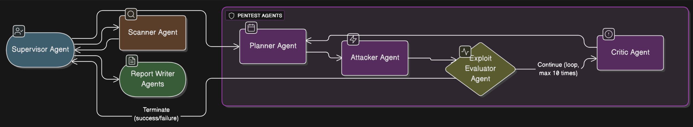
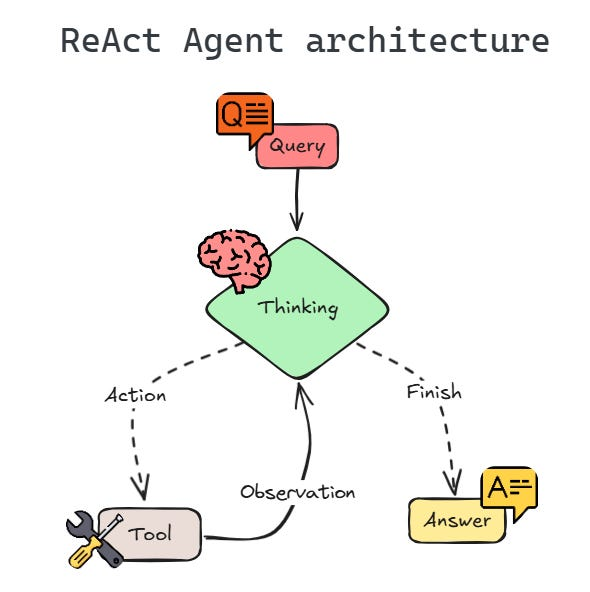
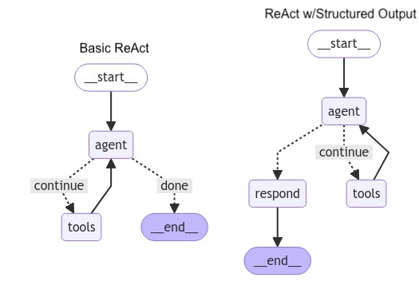
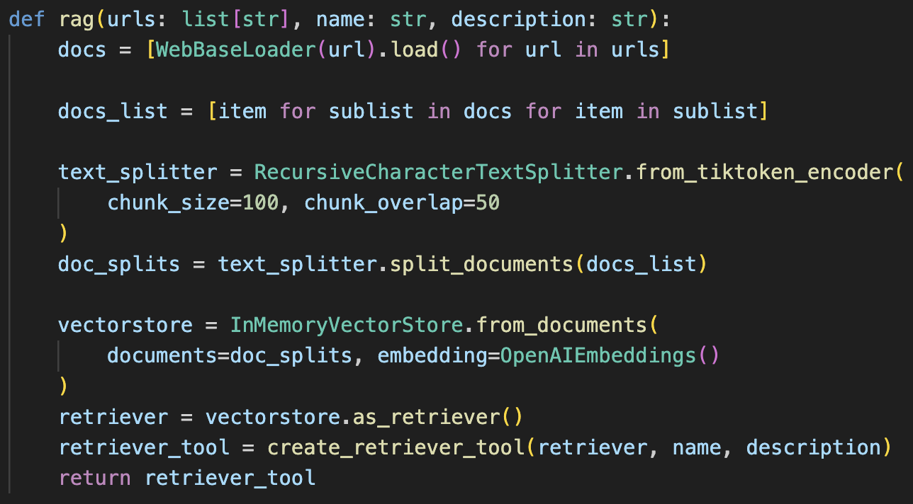

# **Internship Report: Automated Red Team Operations**

## **Background**

Penetration testing plays a vital role in cybersecurity, aimed at proactively identifying vulnerabilities before they can be exploited maliciously. However, traditional penetration testing requires substantial manual effort, expertise, and resources. The cybersecurity talent shortage, particularly for penetration testing specialists, underscores the urgent need for automated solutions. Leveraging advanced artificial intelligence techniques, particularly Large Language Models (LLMs), presents a promising avenue for automating and enhancing penetration testing processes.

## **Introduction**

My internship project, titled "Automated Red Team Operations," builds upon the efforts of previous interns but introduces significant enhancements through the use of an agentic AI framework. The objective was to automate SQL injection (SQLi) using a structured, agent-based system, employing LangGraph and LangChain frameworks, complemented by the Model Context Protocol (MCP). Another intern concurrently undertook a similar project using AutoGen, with a different agent architecture.

Unlike the previous intern, my project focuses on leveraging existing tools directly as callable functions for the agents, particularly Playwright browser automation tools. This approach avoids the risks and limitations associated with allowing the model to generate and execute Python code directly.

## **Project Scope and Objective**

The project aimed explicitly at automating red team techniques leveraging existing open-source tools, specifically focused on automating SQL injection testing through dynamic payload generation, execution, success evaluation, and iterative feedback-driven improvements.

## **Agent Architecture**

The final agent architecture employed in my project is as follows:



#### **1\. Supervisor Agent**

Coordinates the workflow, managing state and transitions between agents.

#### **2\. Scanner Agent**

Discovers injection points using tools such as Amass, FFUF, Nmap, Arjun, Playwright, and web searches.

#### **3\. Planner Agent**

Generates tailored SQLi payloads using a Retrieval-Augmented Generation (RAG) system backed by vector-stored SQL injection cheat sheets.

#### **4\. Attacker Agent**

Executes payloads interactively using Playwright, bypassing traditional issues of request formatting confusion encountered by LLM-generated direct requests.

#### **5\. Exploit Evaluator**

Determines if injections are successful, assessing webpage responses and database behaviors.

#### **6\. Critic Agent**

Evaluates each attack and offers improvements dynamically to the Planner, enhancing payload effectiveness iteratively.

#### **7\. Report Writer**

Documents successful and unsuccessful injection attempts clearly and concisely.

Each agent uses the reAct agent architecture:




## **Implementation**

### **Framework Selection: LangGraph**

I selected LangGraph due to its innovative graph-based framework, popular adoption within the community, and robust helper tools and abstractions. LangGraph provides the flexibility to define agent interactions clearly through nodes and edges, and effectively manage state through reducers, providing a powerful solution to implementing agentic AI patterns.

### **Retrieval-Augmented Generation (RAG)**

To enhance the payload generation capabilities of the Planner agent, I implemented Retrieval-Augmented Generation (RAG). The RAG system leverages a vector store populated with SQL injection cheatsheets, allowing the Planner agent to retrieve relevant payloads dynamically. This ensures generated payloads are contextually appropriate and tailored to specific scenarios identified by the agent.



### **Playwright Integration**

While traditional request methods posed challenges due to varying form data requirements (e.g., JSON, form-url-encoded data), Playwright provided a uniform and reliable solution. Playwright enables agents to interact with web pages exactly as users do—filling in fields, clicking buttons, and following links—thus eliminating confusion regarding data formats and enhancing reliability.

## **Significant Challenges and Solutions**

### **Challenge: LLM Hallucinations and Misunderstandings**

One of the most significant challenges encountered was the Large Language Models' propensity to hallucinate or misunderstand instructions. This issue was particularly detrimental during SQL injection attempts, as it led to inaccurate payload generation and ineffective strategies.

#### **Solution: Prompt Optimization**

To mitigate this issue, substantial effort was invested in optimizing the prompts provided to the agents. By making prompts clear, explicit, and instructional, the likelihood of misinterpretation and hallucination by the LLM was significantly reduced. This involved iterative testing and refinement to ensure clarity and precision in instructions. I also made sure to use prompt engineering techniques like role-based prompting, chain-of-thought prompting, few-shot prompting, and more.

Prompts: [https://www.notion.so/v2-20e18f755603801c9138e27c0d27eb57?source=copy_link](https://www.notion.so/v2-20e18f755603801c9138e27c0d27eb57?source=copy_link)

### **Challenge: Managing State and Historical Context**

Previous implementations relied on using RAG to store historical attempts, which could further confuse the model and provide out of context information.

#### **Solution: Stateful Management**

Instead of using RAG for historical context, my implementation maintained previous attempt information directly in the agent’s state, which was then passed explicitly into system prompts for relevant agents. This approach provided clearer context to each agent, enabling more informed decision-making based on prior results. However, this could significantly increase token count of each prompt if there were many previous attempts, so the dictionaries could be trimmed down further if there is a need to do so, such as by removing fields with justifications.

## **Improvements Over Previous Approaches**

### **Safety and Reliability**

Unlike the previous intern’s approach, which allowed the LLM to generate executable Python code for Playwright, my implementation grants agents direct access to Playwright functions via callable tools. This significantly reduces safety risks and ensures the reliability and correctness of interactions with web pages.

### **Enhanced Payload Generation**

Rather than relying on predefined or repetitive payloads, the integrated RAG system allowed the Planner agent to dynamically query SQL injection resources, generating contextually relevant and effective payloads. This significantly improved the diversity and effectiveness of payload attempts compared to prior implementations.

### **Comprehensive Agent Workflow**

The integration of a dedicated Critic agent added a crucial reflective component, allowing iterative refinement and enhanced payload effectiveness. By critically evaluating each attempt, identifying precise failure reasons, and proposing targeted improvements, the Critic agent significantly enhanced the overall robustness of the workflow.

## **Results and Lessons Learned**

Through iterative testing and refinements, the automated agent successfully identified and exploited SQL injection vulnerabilities in controlled environments. Key lessons learned included the importance of precise instruction in prompts, effective state management, and the strategic integration of retrieval-augmented systems to enhance payload effectiveness.

### **Key Findings:**

- Prompt clarity significantly reduces LLM hallucinations.
- Direct tool access enhances safety and effectiveness.
- Stateful management of previous attempts improves context-awareness.
- RAG enhances payload diversity and relevance.

## **Recommendations and Future Work**

Future extensions of this project could involve integrating additional frameworks such as AutoGen or Open Interpreter for broader applicability. Additionally, integrating tools like Burp Suite could enable more sophisticated attack strategies and improve overall test coverage.

Potential enhancements include:

- Expanding the scope of this project to include other web exploitation vulnerabilities, like XSS, command injection, SSTI, path traversal etc.
- Refining agent architectures further for optimized resource utilization and improved effectiveness. Some of the agents could be split into even more specialised agents, each with multi agent workflows.
- Speed and success rate could be improved by letting the supervisor run agents in parallel ([https://simonwillison.net/2025/Jun/14/multi-agent-research-system/](https://simonwillison.net/2025/Jun/14/multi-agent-research-system/))

```xml
<use_parallel_tool_calls>
For maximum efficiency, whenever you need to perform multiple independent operations, invoke all relevant tools simultaneously rather than sequentially. Call tools in parallel to run subagents at the same time. You MUST use parallel tool calls for creating multiple subagents (typically running 3 subagents at the same time) at the start of the research, unless it is a straightforward query. For all other queries, do any necessary quick initial planning or investigation yourself, then run multiple subagents in parallel. Leave any extensive tool calls to the subagents; instead, focus on running subagents in parallel efficiently.
</use_parallel_tool_calls>
```

## **Conclusion**

The "Automated Red Team Operations" project demonstrated the feasibility and effectiveness of automating penetration testing using advanced AI frameworks. Through strategic use of LangGraph, Playwright, and RAG, significant improvements in payload generation, state management, and iterative refinement were achieved. Addressing challenges related to LLM hallucinations and misunderstandings underscored the critical importance of prompt engineering. This internship provided valuable insights and laid a solid foundation for further innovations in automated penetration testing.

## **Sites**

PicoCTF

- SQLiLite
- More SQLi
- Irish-Name-Repo 1

## **Documentation**

```bash
git clone https://github.com/Craftless/agentic-sqli.git
cd agentic-sqli
Set-ExecutionPolicy Unrestricted -Scope Process
```

### [**Installing uv**](https://docs.astral.sh/uv/getting-started/installation/#installation-methods)

```bash
powershell -ExecutionPolicy ByPass -c "irm https://astral.sh/uv/install.ps1 | iex"
```

### **Setting up the project**

```bash
uv sync
.\.venv\Scripts\activate
playwright install
```

### **Add the .env file in the project root directory**

```bash
OPENAI_API_KEY = 'sk-proj-xxx'
SERPER_API_KEY = 'xxx'
USER_AGENT = "Mozilla/5.0 (Windows NT 10.0; Win64; x64) AppleWebKit/537.36 (KHTML, like Gecko) Chrome/136.0.0.0 Safari/537.36"
LANGSMITH_TRACING=true
LANGSMITH_ENDPOINT="https://api.smith.langchain.com"
LANGSMITH_API_KEY="xxx"
LANGSMITH_PROJECT="xxx"
```

### **MCP tools**

- install the open source tools you need, following installation documentation for the respective tools
- mcp_tools.py only needs to be run once, or whenever the mcp jsons should be regenerated after installing or removing tools

```bash
uv run .\tools\mcp_tools.py
```

### **Run the program**

```bash
uv run main.py <url>
```
